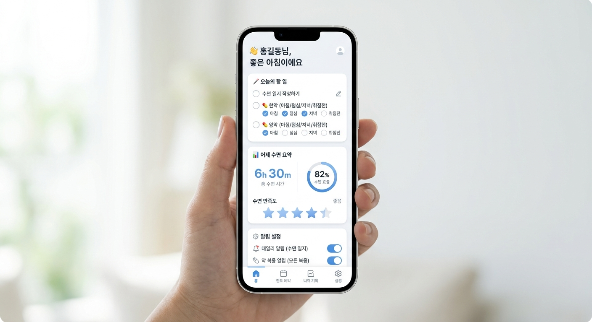
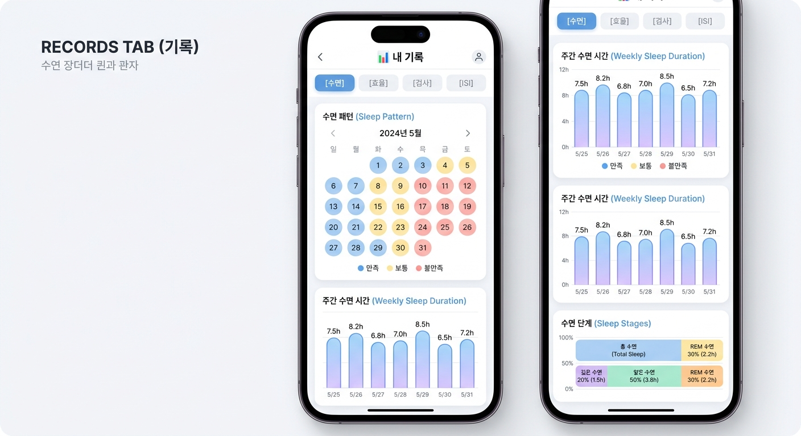
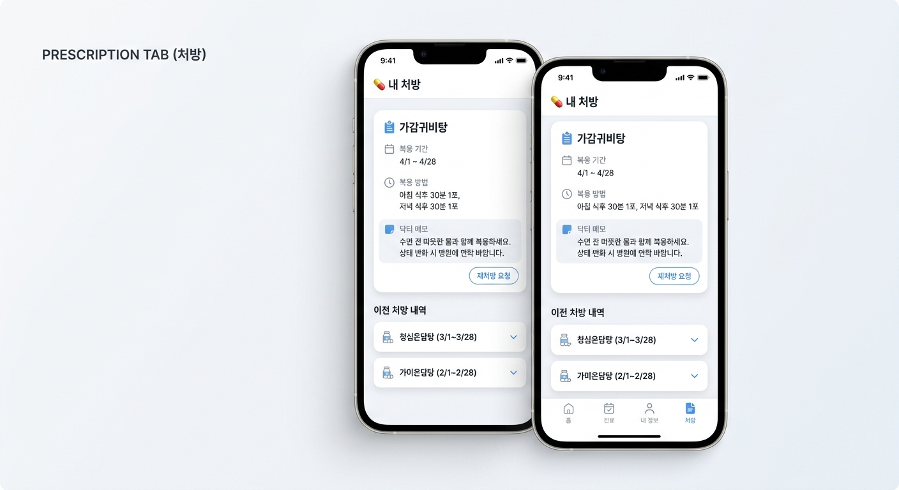
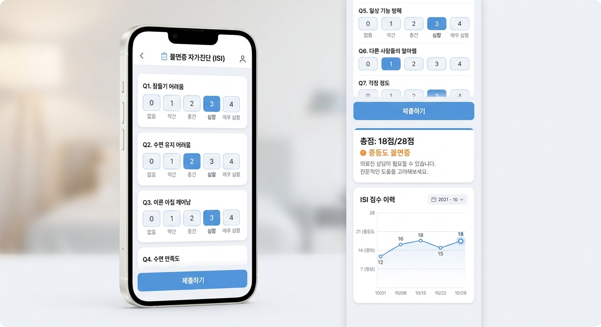
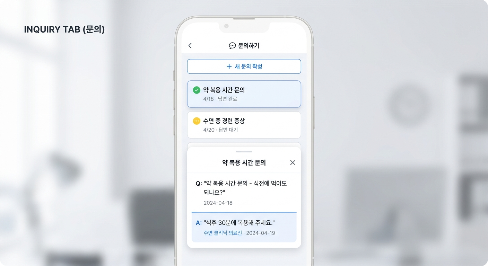

# 환자 앱 디자인 시스템

## 1. 디자인 컨셉

**톤 앤 매너:** 수면장애 클리닉의 신뢰감 있고 차분한 분위기를 반영

**키워드:** 깔끔함, 신뢰, 직관적, 안정감

**디자인 철학:** 환자의 입력 부담을 최소화하고, 데이터는 시각적으로 명확하게 전달

**배경 테마:** 밝은 화이트 + 소프트 그레이 배경, 블루 액센트

---

## 2. 탭별 UI 목업

### 2.1 🏠 홈 탭



홈 탭 목업

- 오늘의 할 일 체크리스트 + 어제 수면 요약 카드
- 처방 환자에게만 한약·양약 복약 체크 항목 노출 (아침/점심/저녁/취침전)

### 2.2 📊 기록 탭



기록 탭 목업

- 4개 서브탭(수면/효율/검사/ISI)
- 캘린더 + 바 차트 + 수면 단계 구성 스택 차트

### 2.3 💊 처방 탭



처방 탭 목업

- 현재 처방 카드(처방명, 기간, 복약 지시, 의사 소견)
- 지난 처방 이력 리스트

### 2.4 📋 자가진단 탭 (ISI)



자가진단 탭 목업

- 7문항 버튼 선택 폼 + 제출 후 결과 카드 + 점수 추이 그래프

### 2.5 💬 문의 탭 (Q&A)



문의 탭 목업

- 문의 목록(답변 상태 배지) + 상세 채팅 스타일 UI

---

## 3. 칼라 팔레트

### 3.1 프라이머리 칼라

| **이름** | **HEX** | **샘플** | **용도** |
| --- | --- | --- | --- |
| White | `#FFFFFF` | **███** | 앱 배경, 카드 배경 |
| Gray 50 | `#F5F7FA` | **███** | 페이지 배경, 섹션 배경 |
| Gray 100 | `#F1F5F9` | **███** | 입력 필드 배경, 비활성 영역 |
| Gray 200 | `#E2E8F0` | **███** | 구분선, 보더 |
| Blue 500 | `#4A90D9` | **███** | **Primary** — 버튼, 활성 탭, 링크, 강조 요소 |
| Blue 400 | `#60A5FA` | **███** | 차트 라인, 서브 강조 |
| Blue 50 | `#EFF6FF` | **███** | 선택 항목 배경, 하이라이트 배경 |

### 3.2 텍스트 칼라

| **이름** | **HEX** | **용도** |
| --- | --- | --- |
| Gray 900 | `#1A202C` | 주 텍스트, 헤딩 |
| Gray 700 | `#4A5568` | 본문 텍스트 |
| Gray 500 | `#718096` | 보조 텍스트, 플레이스홀더 |
| Gray 400 | `#A0AEC0` | 비활성 텍스트, 캡션 |

### 3.3 시맨틱 칼라

| **이름** | **HEX** | **용도** |
| --- | --- | --- |
| Success Green | `#22C55E` | 성공, 답변 완료, 정상 범위(≥85%) |
| Warning Yellow | `#EAB308` | 주의, 답변 대기, 주의 범위(70~85%) |
| Warning Orange | `#F97316` | ISI 중등도 단계 |
| Danger Red | `#EF4444` | 에러, 심각 단계, 불량 범위(<70%) |

### 3.4 차트 칼라 세트

| **용도** | **HEX** | **적용 대상** |
| --- | --- | --- |
| 깊은 수면 (Deep) | `#2563EB` | 수면 단계 스택 바 |
| 얕은 수면 (Light) | `#60A5FA` | 수면 단계 스택 바 |
| REM 수면 | `#93C5FD` | 수면 단계 스택 바 |
| 깨어있음 (Awake) | `#BFDBFE` | 수면 단계 스택 바 |
| 효율 정상 | `#22C55E` | 수면 효율 꺾은선 (≥85%) |
| 효율 주의 | `#EAB308` | 수면 효율 꺾은선 (70~85%) |
| 효율 불량 | `#EF4444` | 수면 효율 꺾은선 (<70%) |

---

## 4. 타이포그래피

### 4.1 폰트 패밀리

| **용도** | **폰트** | **설명** |
| --- | --- | --- |
| 한글 | **Pretendard** | 본문, UI 요소, 버튼 등 모든 한글 텍스트 |
| 영문 | **Inter** | 숫자, 영문 라벨, 코드. Pretendard와 동일한 디자인 DNA 공유로 완벽 호환 |
| 숫자/데이터 | **Inter** | 차트 수치, 점수, 퍼센트 등 Tabular Nums 활용 |

<aside>
💡

**완벽한 조합 이유:** Pretendard는 Inter를 기반으로 제작된 폰트입니다. 두 폰트를 함께 사용하면 한글·영문 혼용 시 x-height, 글자 폭, 자간 등이 자연스럽게 일치합니다.

</aside>

### 4.2 폰트 설치

```css
/* next.config or globals.css */
@import url('https://cdn.jsdelivr.net/gh/orioncactus/pretendard/dist/web/variable/pretendardvariable.css');
@import url('https://fonts.googleapis.com/css2?family=Inter:wght@400;500;600;700&display=swap');

:root {
  --font-sans: 'Pretendard Variable', 'Inter', -apple-system, BlinkMacSystemFont, system-ui, sans-serif;
}
```

### 4.3 타입 스케일

| **토큰명** | **크기** | **굵기** | **줄 높이** | **용도** |
| --- | --- | --- | --- | --- |
| Display | 28px | Bold (700) | 1.3 | 페이지 타이틀, 대형 수치 |
| Heading 1 | 22px | SemiBold (600) | 1.35 | 섹션 헤딩 |
| Heading 2 | 18px | SemiBold (600) | 1.4 | 카드 헤딩, 서브탭 타이틀 |
| Body Large | 16px | Medium (500) | 1.5 | 본문 강조, 버튼 텍스트 |
| Body | 14px | Regular (400) | 1.5 | 일반 본문, 리스트 항목 |
| Caption | 12px | Regular (400) | 1.4 | 보조 정보, 타임스탬프, 라벨 |
| Overline | 11px | Medium (500) | 1.3 | 탭 바 라벨, 배지 텍스트 |

---

## 5. 스페이싱 시스템

### 5.1 기본 간격 (4px 배수)

| **토큰명** | **값** | **용도** |
| --- | --- | --- |
| space-1 | 4px | 아이콘과 텍스트 사이, 미세 조정 |
| space-2 | 8px | 카드 내부 요소 간 간격 |
| space-3 | 12px | 버튼 패딩, 리스트 항목 간격 |
| space-4 | 16px | 카드 내부 패딩, 섹션 간 간격 |
| space-5 | 20px | 화면 좌우 마진 |
| space-6 | 24px | 카드 간 간격, 대형 섹션 분리 |
| space-8 | 32px | 페이지 상단 여백 |

### 5.2 라운드니스 (Border Radius)

| **토큰명** | **값** | **용도** |
| --- | --- | --- |
| radius-sm | 8px | 버튼, 입력 필드, 배지 |
| radius-md | 12px | 카드, 모달, 드롭다운 |
| radius-lg | 16px | 대형 카드, 바텀 시트 |
| radius-full | 9999px | 원형 버튼, 탭 바 항목, 아바타 |

---

## 6. 컴포넌트 스타일 가이드

### 6.1 버튼

```css
/* Primary Button */
.btn-primary {
  @apply bg-blue-500 text-white font-medium text-base
         py-3 px-6 rounded-lg
         hover:bg-blue-600 active:bg-blue-700
         disabled:bg-gray-300 disabled:text-gray-500;
  min-height: 48px;
}

/* Secondary Button (Outlined) */
.btn-secondary {
  @apply bg-white text-blue-500
         border border-blue-500
         font-medium text-base
         py-3 px-6 rounded-lg
         hover:bg-blue-50 active:bg-blue-100;
  min-height: 48px;
}

/* Ghost Button */
.btn-ghost {
  @apply bg-transparent text-gray-600
         font-medium text-sm
         py-2 px-4 rounded-md
         hover:bg-gray-100 active:bg-gray-200;
}
```

### 6.2 카드

```css
/* Base Card */
.card {
  @apply bg-white rounded-xl p-4;
  box-shadow: 0 1px 3px rgba(0, 0, 0, 0.08),
              0 1px 2px rgba(0, 0, 0, 0.04);
}

/* Highlighted Card (e.g. 오늘의 할 일) */
.card-highlight {
  @apply bg-white rounded-xl p-4
         border border-blue-200;
  box-shadow: 0 2px 8px rgba(74, 144, 217, 0.1);
}

/* Stat Card (e.g. 수면 요약) */
.card-stat {
  @apply bg-gray-50 rounded-lg p-3
         flex items-center gap-3;
}
```

### 6.3 탭 바

```css
/* Bottom Tab Bar */
.tab-bar {
  @apply fixed bottom-0 left-0 right-0
         bg-white/95 backdrop-blur-md
         border-t border-gray-200
         flex justify-around items-center
         px-2 pb-safe;
  height: 56px;
}

.tab-item {
  @apply flex flex-col items-center gap-1
         text-gray-400 text-xs;
  min-width: 64px;
  min-height: 44px; /* 터치 최소 영역 */
}

.tab-item-active {
  @apply text-blue-500;
}
```

### 6.4 입력 요소

```css
/* 시간 피커 */
.time-picker {
  @apply bg-gray-50 rounded-lg p-3
         text-gray-900 text-center text-lg
         border border-gray-200;
}

/* 선택 버튼 그룹 (e.g. 0~10분 / 10~30분 / ...) */
.select-group {
  @apply flex gap-2;
}

.select-btn {
  @apply bg-gray-100 text-gray-600 text-sm
         py-2 px-3 rounded-lg
         hover:bg-gray-200
         active:bg-blue-500 active:text-white;
}

.select-btn-active {
  @apply bg-blue-500 text-white;
}

/* 슬라이더 (1~5점) */
.slider {
  @apply w-full h-2 rounded-full
         bg-gray-200
         accent-blue-500;
}

/* 토글 스위치 (알림 설정) */
.toggle {
  @apply relative w-11 h-6 rounded-full
         bg-gray-300
         transition-colors;
}

.toggle-active {
  @apply bg-blue-500;
}
```

### 6.5 배지 / 태그

```css
/* 상태 배지 */
.badge-success  { @apply bg-green-50 text-green-600 text-xs px-2 py-0.5 rounded-full border border-green-200; }
.badge-warning  { @apply bg-yellow-50 text-yellow-600 text-xs px-2 py-0.5 rounded-full border border-yellow-200; }
.badge-orange   { @apply bg-orange-50 text-orange-600 text-xs px-2 py-0.5 rounded-full border border-orange-200; }
.badge-danger   { @apply bg-red-50 text-red-600 text-xs px-2 py-0.5 rounded-full border border-red-200; }

/* ISI 단계 배지 */
.isi-none     { @apply badge-success; }   /* 0~7 */
.isi-mild     { @apply badge-warning; }   /* 8~14 */
.isi-moderate { @apply badge-orange; }    /* 15~21 */
.isi-severe   { @apply badge-danger; }    /* 22~28 */
```

---

## 7. 차트 스타일 가이드 (Recharts)

### 7.1 공통 설정

```tsx
// 차트 공통 테마 (Light)
const chartTheme = {
  backgroundColor: '#FFFFFF',
  gridColor: '#E2E8F0',         // Gray 200
  axisColor: '#718096',         // Gray 500
  tooltipBg: '#FFFFFF',
  tooltipBorder: '#E2E8F0',
  tooltipShadow: '0 4px 12px rgba(0, 0, 0, 0.1)',
  fontFamily: "'Pretendard Variable', 'Inter', sans-serif",
  fontSize: 12,
};
```

### 7.2 차트별 색상

| **차트 유형** | **색상** | **Recharts 컴포넌트** |
| --- | --- | --- |
| 수면 시간 바 | `#4A90D9` 그라디언트 | `<Bar>`  • `linearGradient` |
| 수면 효율 라인 | `#4A90D9` | `<Line>`  • `<ReferenceLine>` (85%, 70%) |
| 수면 단계 스택 | `#2563EB` / `#60A5FA` / `#93C5FD` / `#BFDBFE` | `<Bar stackId="sleep">` |
| ISI 점수 라인 | `#4A90D9` | `<Line>`  • `<ReferenceLine>` (7, 14, 21) |
| 컨디션 추이 | `#60A5FA` | `<Area>`  • 투명 fill |

---

## 8. 아이콘 세트

### 8.1 탭 바 아이콘 (lucide-react 권장)

| **탭** | **아이콘** | **lucide-react 컴포넌트** |
| --- | --- | --- |
| 홈 | 🏠 집 | `<Home />` |
| 기록 | 📊 차트 | `<BarChart3 />` |
| 처방 | 💊 약 | `<Pill />` |
| 자가진단 | 📋 클립보드 | `<ClipboardCheck />` |
| 문의 | 💬 말풍선 | `<MessageCircle />` |

### 8.2 상태 아이콘

| **상태** | **아이콘** | **lucide-react** |
| --- | --- | --- |
| 체크 완료 | ✅ 체크 | `<CheckCircle2 />` |
| 주의 필요 | ⚠️ 경고 | `<AlertTriangle />` |
| 답변 대기 | ⏳ 대기 | `<Clock />` |
| 답변 완료 | ✅ 처리 | `<CheckCircle2 />` |
| 알림 ON/OFF | 🔔 벨 | `<Bell />` / `<BellOff />` |
| 달(수면) | 🌙 초승달 | `<Moon />` |

---

## 9. Tailwind CSS 커스텀 설정

```jsx
// tailwind.config.js (Light Theme)
module.exports = {
  theme: {
    extend: {
      fontFamily: {
        sans: [
          'Pretendard Variable',
          'Inter',
          '-apple-system',
          'BlinkMacSystemFont',
          'system-ui',
          'sans-serif',
        ],
      },
      colors: {
        bg: {
          primary: '#FFFFFF',
          secondary: '#F5F7FA',
          tertiary: '#F1F5F9',
        },
        brand: {
          50: '#EFF6FF',
          100: '#DBEAFE',
          200: '#BFDBFE',
          400: '#60A5FA',
          500: '#4A90D9',
          600: '#3B82F6',
          700: '#2563EB',
        },
        sleep: {
          deep: '#2563EB',
          light: '#60A5FA',
          rem: '#93C5FD',
          awake: '#BFDBFE',
        },
      },
      borderRadius: {
        sm: '8px',
        md: '12px',
        lg: '16px',
      },
      spacing: {
        safe: 'env(safe-area-inset-bottom)',
      },
      boxShadow: {
        card: '0 1px 3px rgba(0,0,0,0.08), 0 1px 2px rgba(0,0,0,0.04)',
        'card-hover': '0 4px 12px rgba(0,0,0,0.1)',
      },
    },
  },
};
```

---

## 10. 레이아웃 가이드라인

### 10.1 화면 규격

| **항목** | **값** | **비고** |
| --- | --- | --- |
| 기준 화면 폭 | 375px | iPhone SE / 13 mini 기준 |
| 최대 화면 폭 | 430px | iPhone 15 Pro Max 기준 |
| 좌우 마진 | 20px | 좌우 동일 |
| 탭 바 높이 | 56px + safe area | iOS Safe Area 대응 |
| 컨텐츠 영역 | 상단 ~ 탭 바 상단 | 스크롤 영역 |

### 10.2 터치 영역 규칙

- 모든 탭 가능한 요소: **최소 44 × 44px**
- 버튼: **최소 높이 48px**
- 입력 필드: **최소 높이 44px**
- 체크박스 / 토글: **최소 24 × 24px** 터치 영역

### 10.3 애니메이션

- **페이지 전환:** `ease-in-out 200ms` (slide-in 또는 fade)
- **카드 표시:** `ease-out 150ms` (scale 0.95 → 1.0 + fade)
- **토글 스위치:** `spring 300ms`
- **스켈레톤:** `pulse 1.5s` (Tailwind 기본)
- **차트 진입:** `ease-out 400ms` (data point 순차 등장)