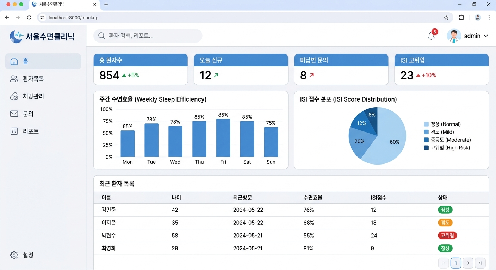
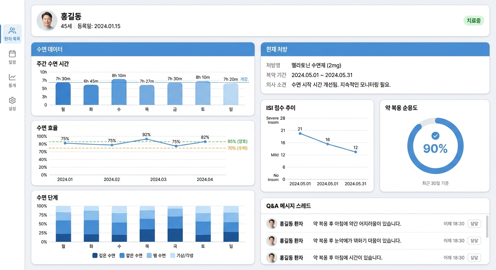
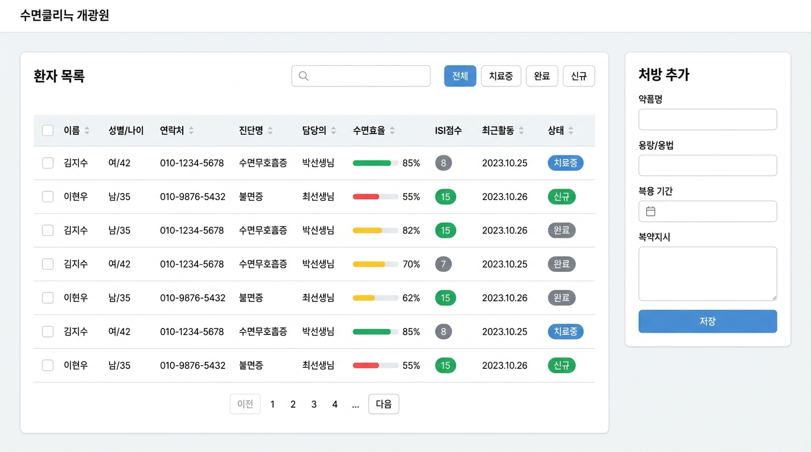

# 관리자 대시보드 디자인 시스템

## 1. 디자인 컨셉

**톤 앤 매너:** 의료 전문가를 위한 신뢰감 있고 효율적인 정보 중심 UI

**키워드:** 데이터 중심, 명료함, 전문성, 빠른 판단 지원

**디자인 철학:** 대량의 환자 데이터를 한눈에 파악하고, 즉각적인 임상 판단이 가능하도록 정보 밀도를 최적화

**배경 테마:** 화이트 + 소프트 그레이 사이드바, 블루 액센트 (환자 앱과 동일 팔레트 공유)

---

## 2. 화면별 UI 목업

### 2.1 🏠 메인 대시보드 (홈)



메인 대시보드 목업

- 상단 KPI 카드 4종: 총 환자수 · 오늘 신규 · 미답변 문의 · ISI 고위험
- 주간 수면효율 Bar Chart + ISI 점수 분포 Pie Chart
- 최근 환자 목록 테이블 (수면효율 %, ISI 점수, 상태 배지)

### 2.2 👤 환자 상세 페이지



환자 상세 목업

- 환자 프로필 헤더 (아바타, 이름, 나이, 등록일, 상태 배지)
- 좌측: 주간 수면 시간 바 차트 + 수면 효율 라인 차트 + 수면 단계 스택 바
- 우측: 현재 처방 카드 + ISI 점수 추이 + 약 복용 순응도 링 차트
- 하단: Q&A 메시지 스레드

### 2.3 📋 환자 목록 & 처방 관리



환자 목록 목업

- 검색 바 + 상태 필터 탭 (전체 / 치료중 / 완료 / 신규)
- 데이터 테이블: 이름 · 성별/나이 · 연락처 · 진단명 · 담당의 · 수면효율 Progress Bar · ISI점수 배지 · 상태
- 우측 사이드패널: 처방 추가 폼 (약품명, 용량/용법, 복용기간, 복약지시, 저장 버튼)

---

## 3. 컬러 팔레트

<aside>
💡

환자 앱과 동일한 컬러 토큰을 공유합니다. 웹 대시보드에는 추가로 **사이드바 컬러**와 **테이블 Row 하이라이트** 토큰이 추가됩니다.

</aside>

### 3.1 프라이머리 컬러

| **이름** | **HEX** | **샘플** | **용도** |
| --- | --- | --- | --- |
| White | `#FFFFFF` | **███** | 페이지 배경, 카드 배경, 테이블 행 |
| Sidebar BG | `#F5F7FA` | **███** | 사이드바 배경, 섹션 구분 |
| Gray 100 | `#F1F5F9` | **███** | 테이블 헤더, 입력 필드 배경 |
| Gray 200 | `#E2E8F0` | **███** | 구분선, 보더, 테이블 행 구분 |
| Blue 500 | `#4A90D9` | **███** | **Primary** — 버튼, 활성 메뉴, 링크, KPI 카드 |
| Blue 400 | `#60A5FA` | **███** | 차트 라인, 서브 강조, 호버 배경 |
| Blue 50 | `#EFF6FF` | **███** | 선택 행 배경, 활성 메뉴 배경 |

### 3.2 텍스트 컬러

| **이름** | **HEX** | **용도** |
| --- | --- | --- |
| Gray 900 | `#1A202C` | 주 텍스트, 테이블 셀, 헤딩 |
| Gray 700 | `#4A5568` | 본문 텍스트, 사이드바 메뉴 |
| Gray 500 | `#718096` | 보조 텍스트, 테이블 헤더, 캡션 |
| Gray 400 | `#A0AEC0` | 비활성 메뉴, 플레이스홀더 |

### 3.3 시맨틱 컬러

| **이름** | **HEX** | **용도** |
| --- | --- | --- |
| Success Green | `#22C55E` | 정상 상태, 치료 완료, 수면효율 ≥85% |
| Warning Yellow | `#EAB308` | 주의 필요, ISI 경도(8~14), 수면효율 70~85% |
| Warning Orange | `#F97316` | ISI 중등도(15~21), 적극 관찰 필요 |
| Danger Red | `#EF4444` | 고위험, ISI 중증(22~28), 수면효율 <70% |
| Info Blue | `#4A90D9` | 신규 환자 배지, 정보성 알림 |

### 3.4 KPI 카드 컬러

| **KPI 항목** | **배경 HEX** | **의미** |
| --- | --- | --- |
| 총 환자수 | `#4A90D9` | 전체 등록 환자 수 |
| 오늘 신규 | `#4A90D9` | 당일 신규 등록 환자 |
| 미답변 문의 | `#4A90D9` | 답변 대기 중인 Q&A |
| ISI 고위험 | `#4A90D9` | ISI ≥22 환자 수 (즉각 주의) |

---

## 4. 타이포그래피

### 4.1 폰트 패밀리

환자 앱과 동일한 **Pretendard + Inter** 조합 사용.

```css
/* globals.css */
@import url('https://cdn.jsdelivr.net/gh/orioncactus/pretendard/dist/web/variable/pretendardvariable.css');
@import url('https://fonts.googleapis.com/css2?family=Inter:wght@400;500;600;700&display=swap');

:root {
  --font-sans: 'Pretendard Variable', 'Inter', -apple-system, BlinkMacSystemFont, system-ui, sans-serif;
}
```

### 4.2 타입 스케일 (웹 대시보드)

| **토큰명** | **크기** | **굵기** | **줄 높이** | **용도** |
| --- | --- | --- | --- | --- |
| Display | 32px | Bold (700) | 1.25 | KPI 수치, 대형 강조 숫자 |
| Heading 1 | 24px | SemiBold (600) | 1.3 | 페이지 타이틀, 섹션 헤딩 |
| Heading 2 | 18px | SemiBold (600) | 1.4 | 카드 헤딩, 패널 타이틀 |
| Body Large | 16px | Medium (500) | 1.5 | 본문 강조, 버튼 텍스트 |
| Body | 14px | Regular (400) | 1.5 | 테이블 셀, 일반 본문 |
| Caption | 12px | Regular (400) | 1.4 | 보조 정보, 타임스탬프, 라벨 |
| Overline | 11px | Medium (500) | 1.3 | 배지 텍스트, KPI 카드 라벨 |

---

## 5. 스페이싱 시스템

### 5.1 기본 간격 (4px 배수)

| **토큰명** | **값** | **용도** |
| --- | --- | --- |
| space-1 | 4px | 아이콘 ↔ 텍스트 간격, 배지 내부 |
| space-2 | 8px | 테이블 셀 패딩 (상하), 태그 간격 |
| space-3 | 12px | 버튼 패딩, 리스트 항목 간격 |
| space-4 | 16px | 카드 내부 패딩, 섹션 간 간격 |
| space-5 | 20px | 사이드바 패딩, 페이지 좌우 여백 |
| space-6 | 24px | 카드 간 간격, 대형 섹션 분리 |
| space-8 | 32px | 페이지 상단 여백, 섹션 구분 |

### 5.2 라운드니스 (Border Radius)

| **토큰명** | **값** | **용도** |
| --- | --- | --- |
| radius-sm | 6px | 버튼, 입력 필드, 배지, 테이블 인라인 요소 |
| radius-md | 10px | 카드, 드롭다운, 모달 |
| radius-lg | 14px | 대형 카드, 사이드 패널 |
| radius-full | 9999px | 상태 배지, 아바타, 링 차트 |

---

## 6. 컴포넌트 스타일 가이드

### 6.1 레이아웃 — 사이드바 + 헤더

```css
/* 전체 레이아웃 */
.layout {
  display: grid;
  grid-template-columns: 240px 1fr;
  grid-template-rows: 64px 1fr;
  min-height: 100vh;
}

/* 사이드바 */
.sidebar {
  @apply bg-gray-50 border-r border-gray-200
         flex flex-col gap-1 p-5;
  grid-row: 1 / -1;
}

.sidebar-item {
  @apply flex items-center gap-3 px-3 py-2.5
         text-gray-600 text-sm rounded-lg
         hover:bg-gray-200 transition-colors;
}

.sidebar-item-active {
  @apply bg-blue-50 text-blue-600 font-medium;
}

/* 헤더 */
.header {
  @apply bg-white border-b border-gray-200
         flex items-center justify-between
         px-6;
  height: 64px;
}
```

### 6.2 KPI 카드

```css
/* KPI 카드 (메인 대시보드 상단 4종) */
.kpi-card {
  @apply bg-blue-500 text-white
         rounded-xl p-5
         flex flex-col gap-2;
}

.kpi-value {
  @apply text-4xl font-bold;
  font-variant-numeric: tabular-nums;
}

.kpi-label {
  @apply text-blue-100 text-sm font-medium;
}

.kpi-delta-positive { @apply text-green-300 text-sm; }
.kpi-delta-negative { @apply text-red-300 text-sm; }
```

### 6.3 데이터 테이블

```css
/* 테이블 래퍼 */
.data-table-wrapper {
  @apply bg-white rounded-xl overflow-hidden;
  box-shadow: 0 1px 3px rgba(0,0,0,0.08);
}

.data-table th {
  @apply bg-gray-50 text-gray-500 text-xs font-medium
         uppercase tracking-wide
         px-4 py-3 text-left
         border-b border-gray-200;
}

.data-table td {
  @apply text-gray-900 text-sm
         px-4 py-3
         border-b border-gray-100;
}

.data-table tr:hover td {
  @apply bg-blue-50;
}

/* 수면효율 Progress Bar */
.efficiency-bar {
  @apply h-2 rounded-full bg-gray-200 w-24;
}
.efficiency-fill-good    { @apply bg-green-500; }  /* ≥85% */
.efficiency-fill-warning { @apply bg-yellow-400; } /* 70~85% */
.efficiency-fill-danger  { @apply bg-red-500; }    /* <70% */
```

### 6.4 버튼

```css
/* Primary */
.btn-primary {
  @apply bg-blue-500 text-white font-medium text-sm
         py-2 px-4 rounded-md
         hover:bg-blue-600 active:bg-blue-700
         disabled:bg-gray-300 disabled:text-gray-500;
  min-height: 36px;
}

/* Secondary (Outlined) */
.btn-secondary {
  @apply bg-white text-blue-500
         border border-blue-500
         font-medium text-sm
         py-2 px-4 rounded-md
         hover:bg-blue-50;
  min-height: 36px;
}

/* Filter Tab 버튼 */
.filter-tab {
  @apply bg-gray-100 text-gray-600 text-sm
         py-1.5 px-3 rounded-md
         hover:bg-gray-200;
}

.filter-tab-active {
  @apply bg-blue-500 text-white;
}
```

### 6.5 상태 배지

```css
.badge-base { @apply text-xs font-medium px-2.5 py-0.5 rounded-full; }

.badge-active   { @apply badge-base bg-blue-100 text-blue-700; }    /* 치료중 */
.badge-new      { @apply badge-base bg-green-100 text-green-700; }  /* 신규 */
.badge-done     { @apply badge-base bg-gray-100 text-gray-600; }    /* 완료 */
.badge-risk     { @apply badge-base bg-red-100 text-red-700; }      /* 고위험 */

/* ISI 단계 배지 */
.isi-none     { @apply badge-base bg-green-100 text-green-700; }   /* 0~7 */
.isi-mild     { @apply badge-base bg-yellow-100 text-yellow-700; } /* 8~14 */
.isi-moderate { @apply badge-base bg-orange-100 text-orange-700; } /* 15~21 */
.isi-severe   { @apply badge-base bg-red-100 text-red-700; }       /* 22~28 */
```

### 6.6 카드

```css
/* Base Card */
.card {
  @apply bg-white rounded-xl p-5;
  box-shadow: 0 1px 3px rgba(0,0,0,0.08), 0 1px 2px rgba(0,0,0,0.04);
}

/* Chart Card */
.card-chart {
  @apply card flex flex-col gap-4;
}

/* Profile Header Card */
.card-profile {
  @apply card flex items-center gap-4
         border-b border-gray-200 rounded-b-none;
}

/* Prescription Card */
.card-prescription {
  @apply card border border-blue-100;
  box-shadow: 0 2px 8px rgba(74, 144, 217, 0.1);
}
```

### 6.7 입력 요소 (처방 추가 폼)

```css
.input {
  @apply w-full bg-gray-50 border border-gray-200
         rounded-md px-3 py-2
         text-sm text-gray-900
         focus:outline-none focus:border-blue-400 focus:bg-white
         placeholder:text-gray-400;
  min-height: 36px;
}

.textarea {
  @apply input resize-none;
  min-height: 80px;
}

.date-picker {
  @apply input cursor-pointer;
}
```

---

## 7. 차트 스타일 가이드 (Recharts)

### 7.1 공통 설정

```tsx
const chartTheme = {
  backgroundColor: '#FFFFFF',
  gridColor: '#E2E8F0',
  axisColor: '#718096',
  tooltipBg: '#FFFFFF',
  tooltipBorder: '#E2E8F0',
  tooltipShadow: '0 4px 12px rgba(0, 0, 0, 0.1)',
  fontFamily: "'Pretendard Variable', 'Inter', sans-serif",
  fontSize: 12,
};
```

### 7.2 차트별 색상 & 컴포넌트

| **차트 유형** | **색상** | **Recharts 컴포넌트** |
| --- | --- | --- |
| 주간 수면효율 바 | `#4A90D9` | `<Bar>`  • `linearGradient` |
| ISI 분포 파이 | 정상/경도/중등/고위험 4색 | `<PieChart>`  • `<Cell>` |
| 환자 수면 시간 바 | `#4A90D9` 그라디언트 | `<Bar>`  • `<ReferenceLine>` |
| 수면 효율 라인 | `#4A90D9` | `<Line>`  • 85%/70% `<ReferenceLine>` |
| 수면 단계 스택 | `#2563EB` / `#60A5FA` / `#93C5FD` / `#BFDBFE` | `<Bar stackId="sleep">` |
| ISI 추이 라인 | `#4A90D9` | `<Line>`  • 7/14/21 기준선 |
| 복용 순응도 링 | `#4A90D9` | `<RadialBarChart>` |

---

## 8. 아이콘 세트 (lucide-react)

### 8.1 사이드바 내비게이션 아이콘

| **메뉴** | **아이콘** | **lucide-react** |
| --- | --- | --- |
| 홈 (대시보드) | 🏠 집 | `<LayoutDashboard />` |
| 환자목록 | 👥 사람들 | `<Users />` |
| 처방관리 | 💊 약 | `<Pill />` |
| 문의 | 💬 말풍선 | `<MessageCircle />` |
| 리포트 | 📊 차트 | `<BarChart3 />` |
| 설정 | ⚙️ 기어 | `<Settings />` |

### 8.2 상태 및 액션 아이콘

| **상태/액션** | **아이콘** | **lucide-react** |
| --- | --- | --- |
| 알림 | 🔔 벨 | `<Bell />` |
| 검색 | 🔍 돋보기 | `<Search />` |
| 정렬 | ↕️ 양방향 화살표 | `<ArrowUpDown />` |
| 필터 | 🔽 필터 | `<Filter />` |
| 처방 추가 | ➕ 플러스 | `<PlusCircle />` |
| 답변 대기 | ⏳ 대기 | `<Clock />` |
| 답변 완료 | ✅ 체크 | `<CheckCircle2 />` |
| 고위험 경고 | ⚠️ 경고 | `<AlertTriangle />` |
| 로그아웃 | 🚪 나가기 | `<LogOut />` |

---

## 9. Tailwind CSS 커스텀 설정

```jsx
// tailwind.config.js (Dashboard)
module.exports = {
  theme: {
    extend: {
      fontFamily: {
        sans: [
          'Pretendard Variable',
          'Inter',
          '-apple-system',
          'BlinkMacSystemFont',
          'system-ui',
          'sans-serif',
        ],
      },
      colors: {
        sidebar: '#F5F7FA',
        brand: {
          50: '#EFF6FF',
          100: '#DBEAFE',
          200: '#BFDBFE',
          400: '#60A5FA',
          500: '#4A90D9',
          600: '#3B82F6',
          700: '#2563EB',
        },
        sleep: {
          deep: '#2563EB',
          light: '#60A5FA',
          rem: '#93C5FD',
          awake: '#BFDBFE',
        },
      },
      borderRadius: {
        sm: '6px',
        md: '10px',
        lg: '14px',
      },
      boxShadow: {
        card: '0 1px 3px rgba(0,0,0,0.08), 0 1px 2px rgba(0,0,0,0.04)',
        'card-hover': '0 4px 12px rgba(0,0,0,0.1)',
        sidebar: '1px 0 0 0 #E2E8F0',
      },
    },
  },
};
```

---

## 10. 레이아웃 가이드라인

### 10.1 화면 규격

| **항목** | **값** | **비고** |
| --- | --- | --- |
| 사이드바 폭 | 240px | 고정 폭, 접이식 지원 |
| 헤더 높이 | 64px | 로고 + 검색 + 알림 + 프로필 |
| 컨텐츠 최대 폭 | 1440px | 넓은 모니터 대응 |
| 컨텐츠 좌우 패딩 | 24px | 사이드바 제외 영역 |
| 카드 그리드 | 12 컬럼 | KPI 4열: 3col each |
| 반응형 브레이크포인트 | 1024px / 768px | 사이드바 접힘 / 모바일 대응 |

### 10.2 그리드 레이아웃 패턴

```css
/* KPI 카드 4열 */
.kpi-grid {
  @apply grid grid-cols-4 gap-4;
}

/* 차트 2열 (메인 대시보드) */
.chart-grid-2 {
  @apply grid grid-cols-2 gap-4;
}

/* 환자 상세: 좌 2/3 + 우 1/3 */
.detail-grid {
  @apply grid gap-4;
  grid-template-columns: 2fr 1fr;
}

/* 반응형 대응 */
@media (max-width: 1024px) {
  .kpi-grid { @apply grid-cols-2; }
  .chart-grid-2 { @apply grid-cols-1; }
  .detail-grid { @apply grid-cols-1; }
}
```

### 10.3 애니메이션

- **페이지 전환:** `ease-in-out 150ms` (fade)
- **카드 호버:** `ease-out 100ms` (shadow 강화)
- **테이블 행 호버:** `ease-out 80ms` (bg-blue-50)
- **사이드바 접힘:** `ease-in-out 200ms` (translate + width)
- **차트 진입:** `ease-out 400ms` (data 순차 등장)
- **스켈레톤:** `pulse 1.5s` (Tailwind 기본)